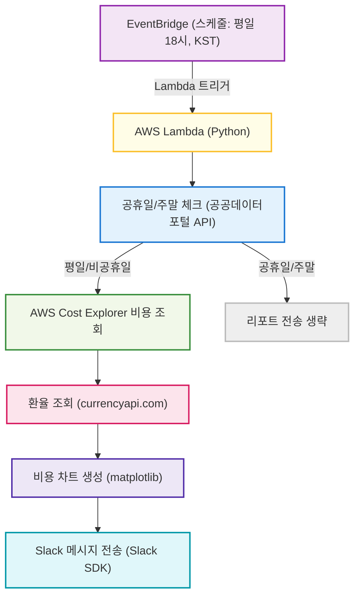

# Step1. 2025-07-15

## 오늘의 작업 요약

### Situation (상황)
- AWS 비용을 매일 평일 오후 6시(한국시간)에 Slack으로 자동 보고하는 서버리스 서비스를 구축하고자 했습니다.
- 공휴일/주말에는 리포트가 전송되지 않아야 하며, 비용 데이터와 환율, 시각화 차트까지 포함해 가독성 높은 메시지를 전달하는 것이 목표였습니다.

### Task (과제)
- Python 기반 AWS Lambda 함수와 모듈별 구조 설계
- 공휴일/주말 체크, 비용/환율 조회, 차트 생성, Slack 전송 등 각 기능을 모듈로 분리
- 테스트 코드(단위/통합) 작성 및 오류 수정
- 아키텍처 다이어그램 작성 및 문서화 시작

### Action (실행)
- Lambda 메인 핸들러와 각 기능별 모듈(공휴일, 비용, 환율, 차트, Slack) 구현
- .env 환경변수 관리, pyproject.toml 의존성 관리, setup_env.py, deploy.sh 등 스크립트 작성
- pytest 기반 단위/통합 테스트 코드 작성 및 반복적인 오류(함수 patch, 시그니처, 메시지 등) 수정
- 테스트가 모두 통과하도록 patch 경로, assert 구문, fixture 등 리팩터링
- docs 디렉토리 생성 및 개발 기록 문서화 시작

### Result (결과)
- 모든 통합 테스트가 정상적으로 통과함을 확인
- 각 기능별 모듈이 독립적으로 동작하며, 전체 서비스 플로우가 안정적으로 연결됨
- 아키텍처 다이어그램을 통해 전체 흐름을 한눈에 파악할 수 있게 됨
- 앞으로도 이 구조를 기반으로 기능 확장 및 오픈소스화를 진행할 예정

---

## 서비스 아키텍처 (Mermaid 다이어그램)

---

## 앞으로의 계획
- 오늘 설계한 아키텍처와 모듈 구조를 기반으로, 실제 AWS 환경에 배포 및 운영 자동화까지 확장할 예정입니다.
- 오픈소스 공개를 염두에 두고, 문서화와 코드 품질 관리도 지속적으로 병행할 계획입니다.
- 추가적인 기능(예: Slack 메시지 커스터마이즈, 비용 알림 임계치 설정 등)도 점진적으로 도입할 예정입니다.

---